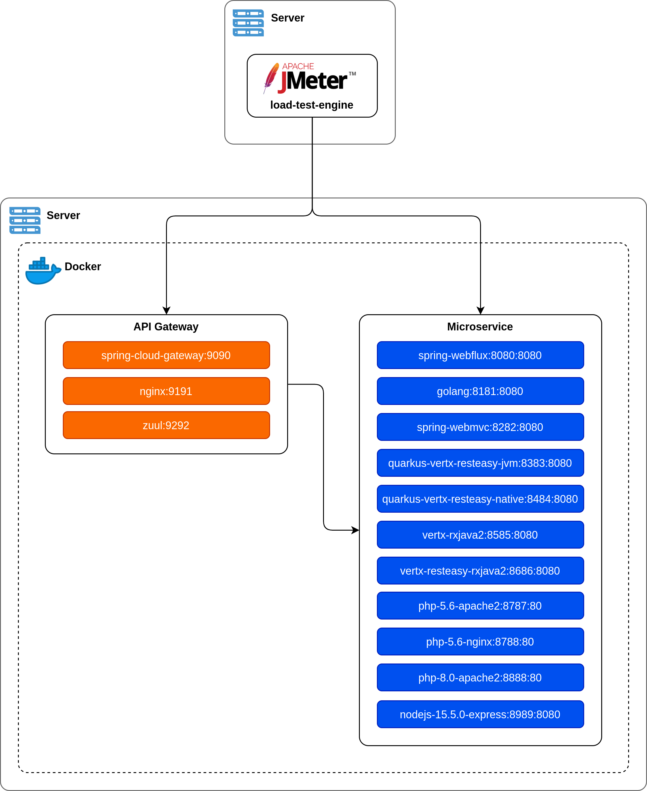

# Demo API-Gateway with Microservices

## Topology


## Technology
- Spring Cloud Netflix Eureka
- Spring Cloud Gateway
- Spring Webflux
- Spring Webmvc
- Golang
- Kong
- Nginx
- [ ] NodeJS
- JMeter (test-plan-jmeter.jmx)

## Pre requiste
- Docker

## List of API Gateway / Reverse proxy
- Spring Cloud Gateway
- Kong
- Nginx

## List of Microservices
- Spring Webflux
- Spring Webmvc
- Go

## Build & Run
```shell script
./build-run
```

## API Endpoint

### API Gateway
 - URL: 
    - /webflux/hello/name
    - /webflux-lb/hello/name
    - /webmvc/hello/name
    - /go/hello/name
 - Query Parameter:
    - delay (optional)
 - API Gateway port:
    - Spring Cloud Gateway: 9090
    - Nginx: 9191

### Microservice
 - URL: 
    - /hello/name
 - Query Parameter:
    - delay (optional)
 - Microservice port:
    - Spring Webflux: 8080
    - Golang: 8181
    - Spring Webmvc: 8282

## Test
Open jmeter test plan file (<b>test-plan-jmeter.jmx</b>) to run the test.<br/>
Available <b>User Define Variables</b>:
- gwhost (API Gateway hostname/IP address)
- mshost (Microservice hostname/ip address)
- delay (Microservice request delay in milliseconds)
- concurrent (Number of threads(users) each thread group)
- duration (Test duration in seconds)
- rampup (Ramp-up period in seconds)